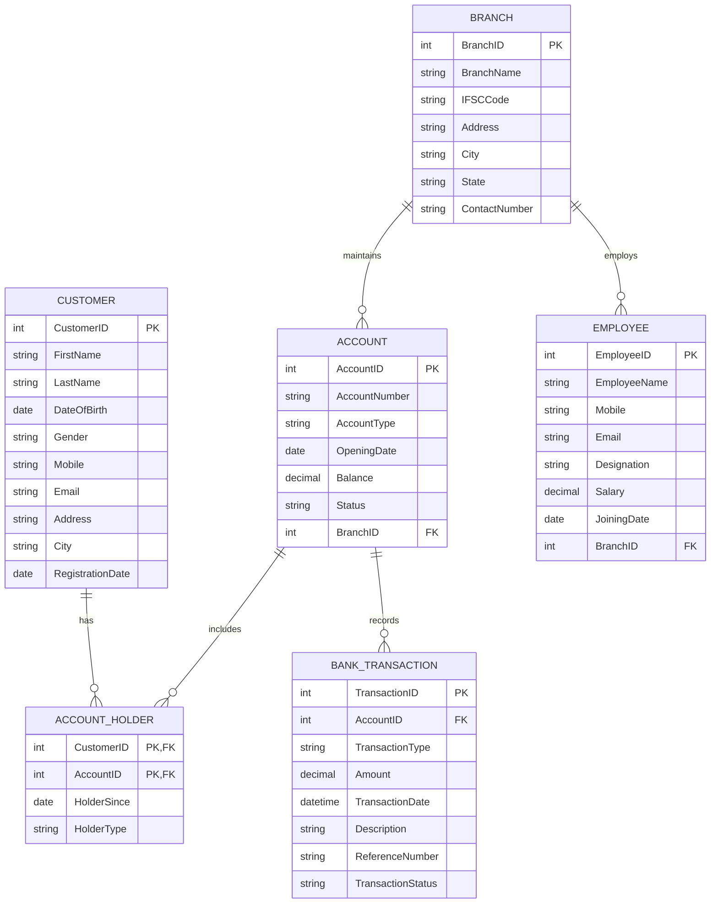

# Project KASHI — ER Diagram

```mermaid
erDiagram
    CUSTOMER ||--o{ ACCOUNT_HOLDER : has
    ACCOUNT ||--o{ ACCOUNT_HOLDER : includes
    BRANCH ||--o{ EMPLOYEE : employs
    BRANCH ||--o{ ACCOUNT : maintains
    ACCOUNT ||--o{ BANK_TRANSACTION : records

    CUSTOMER {
        int CustomerID PK
        string FirstName
        string LastName
        date DateOfBirth
        string Gender
        string Mobile
        string Email
        string Address
        string City
        date RegistrationDate
    }

    BRANCH {
        int BranchID PK
        string BranchName
        string IFSCCode
        string Address
        string City
        string State
        string ContactNumber
    }

    EMPLOYEE {
        int EmployeeID PK
        string EmployeeName
        string Mobile
        string Email
        string Designation
        decimal Salary
        date JoiningDate
        int BranchID FK
    }

    ACCOUNT {
        int AccountID PK
        string AccountNumber
        string AccountType
        date OpeningDate
        decimal Balance
        string Status
        int BranchID FK
    }

    ACCOUNT_HOLDER {
        int CustomerID PK, FK
        int AccountID PK, FK
        date HolderSince
        string HolderType
    }

    BANK_TRANSACTION {
        int TransactionID PK
        int AccountID FK
        string TransactionType
        decimal Amount
        datetime TransactionDate
        string Description
        string ReferenceNumber
        string TransactionStatus
    }
```
